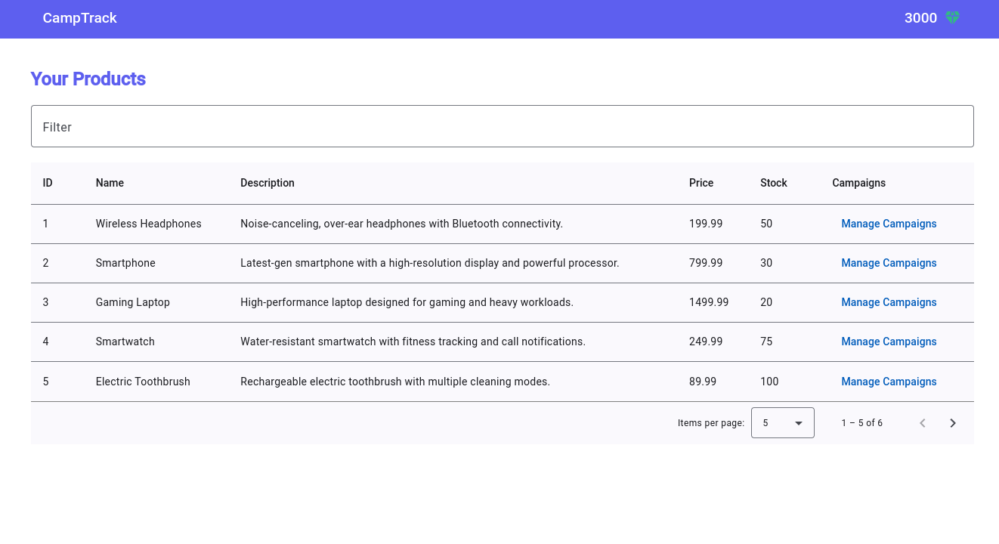
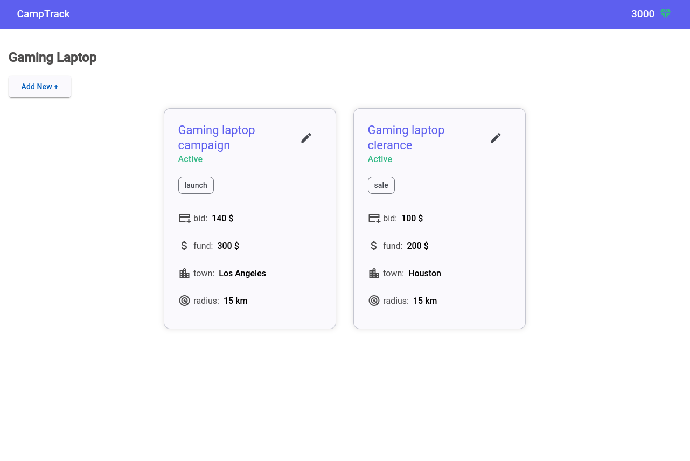

# Campaign Management App

This project is a campaign management system where a predefined list of products can have associated campaigns. Each campaign is funded from an "emerald" balance, which is stored in the local storage. When a campaign is deleted, the funds are returned to the emerald account.

Local storage is used to persist both the campaigns and the emerald balance, ensuring that data is retained even after page reloads.

This is my first project built with Angular, where I utilized Angular and Angular Material UI to create an interface. In the future, I plan to integrate a backend system and allow users to add products and manage campaigns dynamically.

You can check out the live version of the app [here](https://camp-track.vercel.app/).

## Technologies Used:

- Angular
- Angular Material UI

## Pictures

